# Practica 2.1

## Instalación servidor web Nginx

Para instalar el servidor nginx en nuestra Debian, primero actualizamos 
los repositorios y después instalamos el paquete correspondiente:

`sudo apt update`
`sudo apt install nginx`

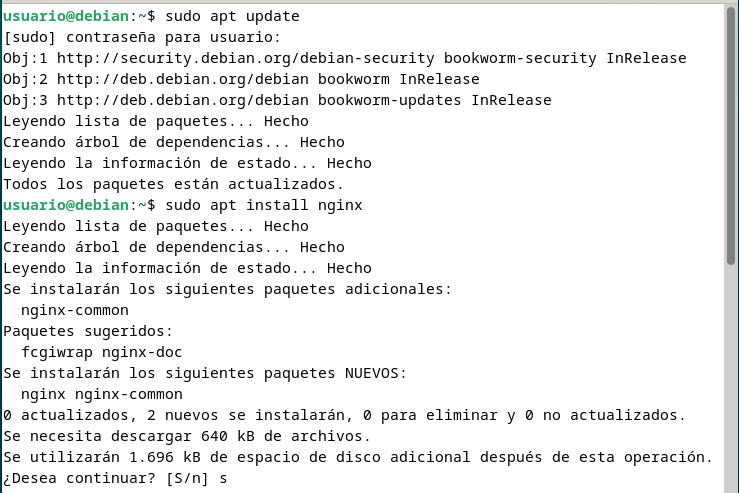

Comprobamos que nginx se ha instalado y que está funcionando correctamente:

`systemctl status nginx`

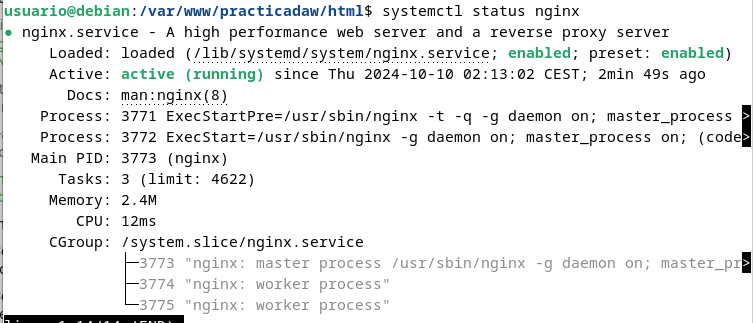

## Creación de las carpeta del sitio web

Igual que ocurre en Apache, todos los archivos que formarán parte de un sitio web que servirá nginx se organizarán en carpetas. Estas carpetas, típicamente están dentro de /var/www.

Así pues, vamos a crear la carpeta de nuestro sitio web o dominio:

`sudo mkdir -p /var/www/nombre_web/html`


Dentro de esa carpeta html, debéis clonar el siguiente repositorio:

`https://github.com/cloudacademy/static-website-example`


Además, haremos que el propietario de esta carpeta y todo lo que haya dentro 
sea el usuario www-data, típicamente el usuario del servicio web.

`sudo chown -R www-data:www-data /var/www/nombre_web/html`


Y le daremos los permisos adecuados para que no nos de un error de acceso 
no autorizado al entrar en el sitio web:

`sudo chmod -R 755 /var/www/nombre_web`


Para comprobar que el servidor está funcionando y sirviendo páginas 
correctamente, podéis acceder desde vuestro cliente a:

`http://IP-maq-virtual`

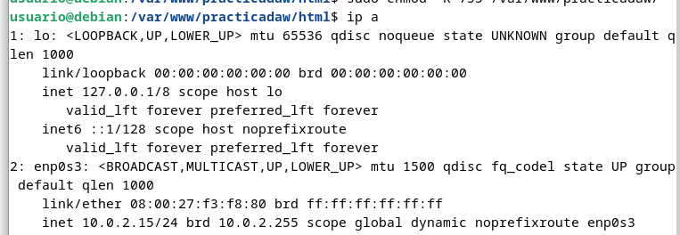

Y os deberá aparecer algo así:

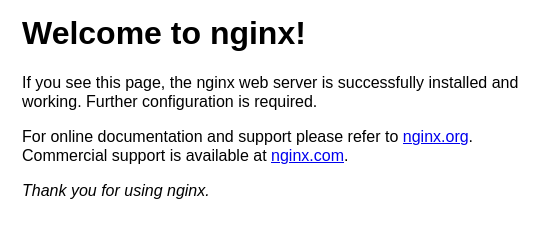

Lo que demuestra que todo es correcto hasta ahora.

## Configuración de servidor web NGINX

En Nginx hay dos rutas importantes. La primera de ellas es sites-available, que contiene los archivos de configuración de los hosts virtuales o bloques disponibles en el servidor. Es decir, cada uno de los sitios webs que alberga el servido. La otra es sites-enabled, que contiene los archivos de configuración de los sitios habilitados, es decir, los que funcionan en ese momento.

Dentro de sites-available hay un archivo de configuración por defecto (default), que es la página que se muestra si accedemos al servidor sin indicar ningún sitio web o cuando el sitio web no es encontrado en el servidor (debido a una mala configuración por ejemplo). Esta es la página que nos ha aparecido en el apartado anterior.

Para que Nginx presente el contenido de nuestra web, es necesario crear un bloque de servidor con las directivas correctas. En vez de modificar el archivo de configuración predeterminado directamente, crearemos uno nuevo en /etc/nginx/sites-available/nombre_web:

`sudo nano /etc/nginx/sites-available/vuestro_dominio`

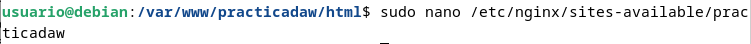

Y el contenido de ese archivo de configuración:

```code
server {
        listen 80;
        listen [::]:80;
        root /ruta/absoluta/archivo/index;
        index index.html index.htm index.nginx-debian.html;
        server_name nombre_web;
        location / {
                try_files $uri $uri/ =404;
        }
}
```

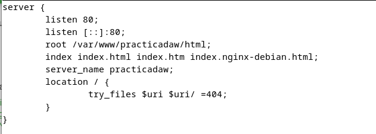

Aquí la directiva root debe ir seguida de la ruta absoluta absoluta dónde se encuentre el archivo index.html de nuestra página web, que se encuentra entre todos los que habéis descomprimido.

Y crearemos un archivo simbólico entre este archivo y el de sitios que están habilitados, para que se dé de alta automáticamente.

`sudo ln -s /etc/nginx/sites-available/nombre_web /etc/nginx/sites-enabled/`

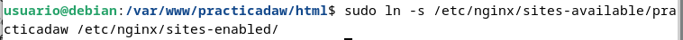

Y reiniciamos el servidor para aplicar la configuración:

`sudo systemctl restart nginx`


## Comprobaciones

#### Comprobación del correcto funcionamiento

Como aún no poseemos un servidor DNS que traduzca los nombres a IPs, debemos hacerlo de forma manual. Vamos a editar el archivo /etc/hosts de nuestra máquina anfitriona para que asocie la IP de la máquina virtual, a nuestro server_name.

Este archivo, en Linux, está en: `/etc/hosts`

Y en Windows: `C:\Windows\System32\drivers\etc\hosts`

Y deberemos añadirle la línea:

`192.168.X.X nombre_web`

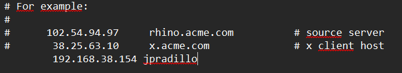

donde debéis sustituir la IP por la que tenga vuestra máquina virtual.

#### Comprobar registros del servidor

Comprobad que las peticiones se están registrando correctamente en los archivos de logs, tanto las correctas como las erróneas:
 - /var/log/nginx/access.log: cada solicitud a su servidor web se registra en este archivo de registro, a menos que Nginx esté configurado para hacer algo diferente.
 - /var/log/nginx/error.log: cualquier error de Nginx se asentará en este registro

> ℹ️ **Información:** Si no os aparece nada en los logs, podría pasar que el navegador ha cacheado la página web y que, por tanto, ya no está obteniendo la página del navegador sino de la propia memoria. Para solucionar esto, podéis acceder con el modo privado del navegador y ya os debería registrar esa actividad en los logs.

## FTP

Si queremos tener varios dominios o sitios web en el mismo servidor nginx (es decir, que tendrán la misma IP) debemos repetir todo el proceso anterior con el nuevo nombre de dominio que queramos configurar.

##### ¿Cómo transferir archivos desde nuestra máquina local/anfitrión a nuestra máquina virtual Debian/servidor remoto?

A día de hoy el proceso más sencillo y seguro es a través de Github como hemos visto antes. No obstante, el currículum de la Consellería d'Educació me obliga a enseñaros un método un tanto obsoleto a día de hoy, así que vamos a ello, os presento al FTP.

El FTP es un protocolo de transferencia de archivos entre sistemas conectados a una red TCP. Como su nombre indica, se trata de un protocolo que permite transferir archivos directamente de un dispositivo a otro. Actualmente, es un protocolo que poco a poco va abandonándose, pero ha estado vigente más de 50 años.

El protocolo FTP tal cual es un protocolo inseguro, ya que su información no viaja cifrada. Sin embargo, en 2001 esto se solucionó con el protocolo SFTP, que le añade una capa SSH para hacerlo más seguro y privado.

SFTP no es más que el mismo protocolo FTP pero implementado por un canal seguro. Son las siglas de SSH File Transfer Protocol y consiste en una extensión de Secure Shell Protocol (SSH) creada para poder hacer transmisiones de archivos.

La seguridad que nos aporta SFTP es importante para la transferencia de archivos porque, si no disponemos de ella, los archivos viajarán tal cual por la red, sin ningún tipo de encriptación. Así pues, usando FTP tradicional, si algún agente consigue escuchar las transferencias, podría ocurrir que la información quedase al descubierto. Esto sería especialmente importante si los archivos que subimos contienen información confidencial o datos personales.

Dado que usar SFTP aporta mayor seguridad a las transmisiones, es recomendable utilizarlo, más aún sabiendo que realmente no hay mucha dificultad en establecer las conexiones por el protocolo seguro.

#### Configurar servidor SFTP en Debian

En primer lugar, lo instalaremos desde los repositorios:

```code
sudo apt-get update
sudo apt-get install vsftpd
```

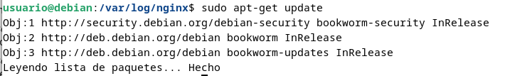
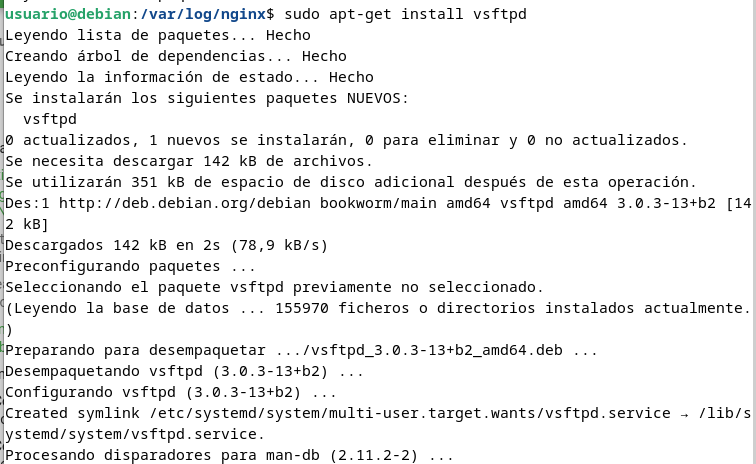

Ahora vamos a crear una carpeta en nuestro home en Debian:

`mkdir /home/nombre_usuario/ftp`


En la configuración de vsftpd indicaremos que este será el directorio al cual vsftpd se cambia después de conectarse el usuario.

Ahora vamos a crear los certificados de seguridad necesarios para aportar la capa de cifrado a nuestra conexión (algo parecido a HTTPS)

`sudo openssl req -x509 -nodes -days 365 -newkey rsa:2048 -keyout /etc/ssl/private/vsftpd.pem -out /etc/ssl/private/vsftpd.pem`


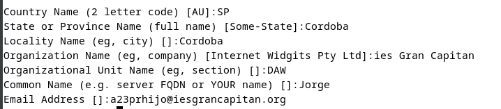

Y una vez realizados estos pasos, procedemos a realizar la configuración de vsftpd propiamente dicha. Se trata, con el editor de texto que más os guste, de editar el archivo de configuración de este servicio, por ejemplo con nano:

`sudo nano /etc/vsftpd.conf`


En primer lugar, buscaremos las siguientes líneas del archivo y las eliminaremos por completo:

```code
rsa_cert_file=/etc/ssl/certs/ssl-cert-snakeoil.pem
rsa_private_key_file=/etc/ssl/private/ssl-cert-snakeoil.key
ssl_enable=NO
```

Tras ello, añadiremos estas líneas en su lugar

```code
rsa_cert_file=/etc/ssl/private/vsftpd.pem
rsa_private_key_file=/etc/ssl/private/vsftpd.pem
ssl_enable=YES
allow_anon_ssl=NO
force_local_data_ssl=YES
force_local_logins_ssl=YES
ssl_tlsv1=YES
ssl_sslv2=NO
ssl_sslv3=NO
require_ssl_reuse=NO
ssl_ciphers=HIGH

local_root=/home/nombre_usuario/ftp
```

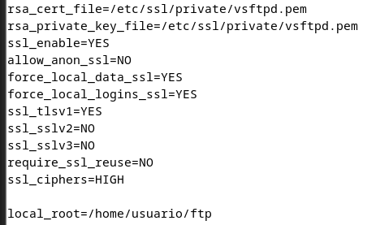

Y, tras guardar los cambios, reiniciamos el servicio para que coja la nueva configuración:

`sudo systemctl restart --now vsftpd`


Tras acabar esta configuración, ya podremos acceder a nuestro servidor mediante un cliente FTP adecuado, como por ejemplo Filezilla de dos formas, a saber:
- Mediante el puerto por defecto del protocolo inseguro FTP, el 21, pero utilizando certificados que cifran el intercambio de datos convirtiéndolo así en seguro
- Haciendo uso del protocolo SFTP, dedicado al intercambio de datos mediante una conexión similar a SSH, utilizando de hecho el puerto 22.

Tras descargar el cliente FTP en nuestro ordenador, introducimos los datos necesarios para conectarnos a nuestro servidor FTP en Debian:

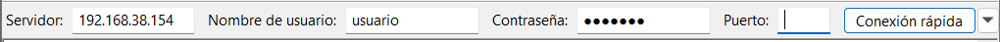

- La IP de Debian
- El nombre de usuario de Debian
- La contraseña de ese usuario 
- El puerto de conexión, que será el 21 para conectarnos utilizando los certificados generados previamente

Tras darle al botón de Conexión rápida, nos saltará un aviso a propósito del certificado, le damos a aceptar puesto que no entraña peligro ya que lo hemos genrado nosotros mismos:

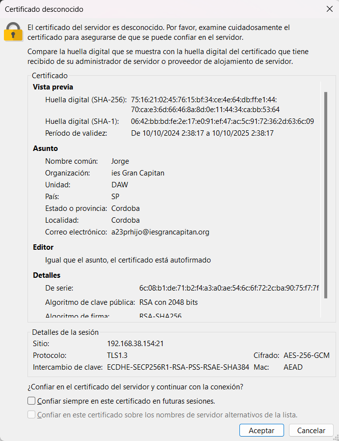

Nos conectaremos directamente a la carpeta que le habíamos indicado en el archivo de configuración /home/raul/ftp

Una vez conectados, buscamos la carpeta de nuestro ordenador donde hemos descargado el .zip (en la parte izquierda de la pantalla) y en la parte derecha de la pantalla, buscamos la carpeta donde queremos subirla. Con un doble click o utilizando botón derecho > subir, la subimos al servidor.

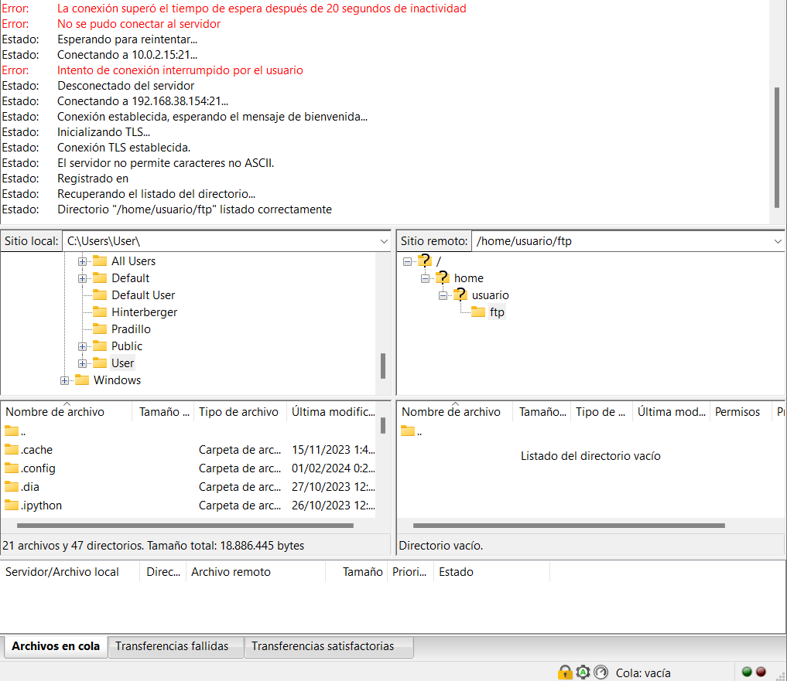

Si lo que quisiéramos es conectarnos por SFTP, exactamente igual de válido, haríamos:

Fijáos que al utilizar las claves de SSH que ya estamos utilizando desde la Práctica 1, no se debe introducir la contraseña, únicamente el nombre de usuario.

Puesto que nos estamos conectando usando las claves FTP, nos sale el mismo aviso que nos salía al conectarnos por primera vez por SSH a nuestra Debian, que aceptamos porque sabemos que no entraña ningún peligro en este caso:

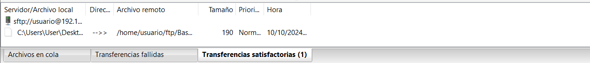

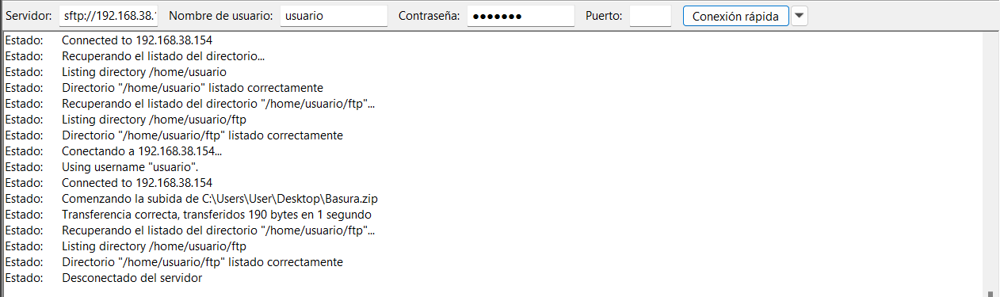

Y vemos que al ser una especie de conexión SSH, nos conecta al home del usuario, en lugar de a la carpeta ftp. A partir de aquí ya procederíamos igual que en el otro caso.

Recordemos que debemos tener nuestro sitio web en la carpeta /var/www y darle los permisos adecuados, de forma similiar a cómo hemos hecho con el otro sitio web.

El comando que nos permite descomprimir un .zip en un directorio concreto es:

`unzip archivo.zip -d /nombre/directorio`


Si no tuvieráis unzip instalado, lo instaláis:

`sudo apt-get update && sudo apt-get install unzip`

## HTTPS

En este apartado le añadiremos a nuestro servidor una capa de seguridad necesaria. Haremos que todos nuestros sitios web alojados hagan uso de certificados SSL y se acceda a ellos por medio de HTTPS.

Para ello, a modo de prueba de concepto, nos generaremos unos certificados autofirmados y, en el fichero de configuración de nuestros hosts virtuales (los sitios web que hemos configurado), deberemos cambiar los parámetros necesarios.

Apoyaos en una búsqueda en Internet para conseguir vuestro objetivo.

#### Redirección HTTP a HTTPS

Cuando hayáis cumplido con la tarea de dotar de HTTPS a vuestros sitios web, podréis pasar a esta.

Fijáos que con el estado de la configuración actual, a vuestro sitio web se puede acceder aún de dos formas simultáneas, por el puerto 80 (HTTP e inseguro) y por el puerto 443 (HTTPS, seguro). Puesto que queremos dejar la configuración bien hecha y sin posibles fisuras, vuestro objetivo es que si el usuario accede a vuestro sitio web mediante el puerto 80 (HTTP) automáticamente, por motivos de seguridad, se le redirija a HTTPS, en el puerto 443.

Realizad la búsqueda de información adecuada para conseguir esta redirección automática mediante los cambios necesarios en vuestros archivos de hosts virtuales.

Primero que nada entraremos en el archivo:

`sudo nano /etc/nginx/sites-available/practicadaw`

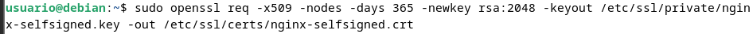

Editar el script que había antes:

```code
server {
    listen 80;
    listen [::]:80;
    server_name practicadaw;

    return 301 https://$server_name$request_uri;
}
```

y añadir debajo:

```code
server {
    listen 443 ssl;
    listen [::]:443 ssl;
    server_name practicadaw;

    ssl_certificate /etc/ssl/certs/nginx-selfsigned.crt;
    ssl_certificate_key /etc/ssl/private/nginx-selfsigned.key;

    root /var/www/practicadaw/html/static-website-example/;
    index index.html index.htm index.nginx-debian.html;

    location / {
        try_files $uri $uri/ =404;
    }
}
```

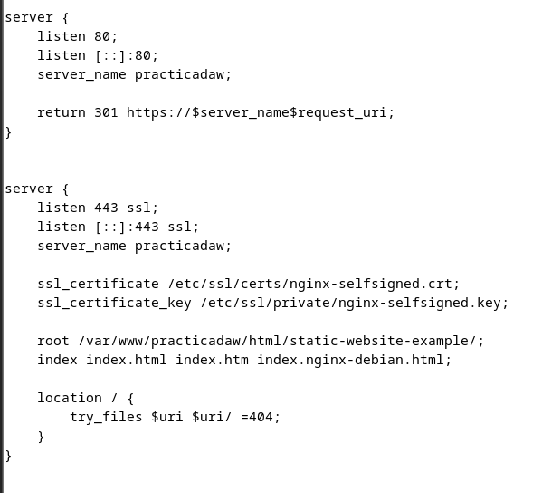

Finalmente comprobamos que se nos abra la web y muestre este mensaje. Tras esto ya tendremos nuestra web con nginx desplegada.


## Cuestiones finales

### 🟦 Cuestión 1

> **¿Qué pasa si no hago el link simbólico entre `sites-available` y `sites-enabled` de mi sitio web?**

Si no haces el enlace simbólico entre `sites-available`y `sites-enabled`

- Provocarás que tu sitio no esté activo, produciendo errores de acceso (como 404)
- Aunque hayas hecho la configuración de `sites-available`, el servidor no las reconocerá.
- Hay riesgo de errores en la configuración que podrían dar la impresión de que el servidor está funcionando después de reiniciarse o recargarse, cuando en realidad no lo está.
- Pueden haber problemas en la administración de sitios por la dificultad a la hora de gestionar varias configuraciones de sitios, ya que no es posible habilitar o deshabilitar un sitio de manera fácil al agregar o eliminar el enlace en sites-enabled.

### 🟦 Cuestión 2

> **¿Qué pasa si no le doy los permisos adecuados a `/var/www/nombre_web`?**

- El servidor web no podrá leer los archivos.
- Si el sitio necesita escribir archivos fallará si no tiene permisos de escritura.
- Otros usuarios o servicios que dependan de esos archivos no podrán acceder.
  