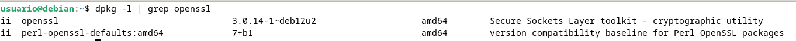
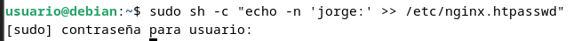
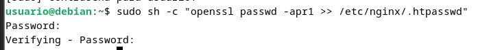
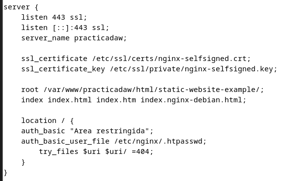
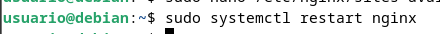

# Práctica 2.2

## Requisitos antes de comenzar la práctica

> ⚡ **Atención, muy importante antes de empezar**
> 
> - La práctica 2.1 ha de estar funcionando correctamente.
> - No empezar la práctica antes de tener la 2.1 **funcionando y comprobada**.

### Introducción

En el contexto de una transacción HTTP, la autenticación de acceso básica es un método diseñado para permitir a un navegador web, u otro programa cliente, proveer credenciales en la forma de usuario y contraseña cuando se le solicita una página al servidor.

La autenticación básica, como su nombre lo indica, es la forma más básica de autenticación disponible para las aplicaciones Web. Fue definida por primera vez en la especificación HTTP en sí y no es de ninguna manera elegante, pero cumple su función.

Este tipo de autenticación es el tipo más simple disponible pero adolece de importantes problemas de seguridad que no la hacen recomendable en muchas situaciones. No requiere el uso ni de cookies, ni de identificadores de sesión, ni de página de ingreso.

### Paquetes necesarios

Para esta práctica podemos utilizar la herramienta openssl para crear las contraseñas.

En primer lugar debemos comprobar si el paquete está instalado:

`dpkg -l | grep openssl`

Y si no lo estuviera, instalarlo.

### Creación de usuarios y contraseñas para el acceso web

Crearemos un archivo oculto llamado “.htpasswd” en el directorio de configuración /etc/nginx donde guardar nuestros usuarios y contraseñas (la -c es para crear el archivo):

`sudo sh -c "echo -n 'vuestro_nombre:' >> /etc/nginx/.htpasswd"`

Ahora crearemos un password cifrado para el usuario:

`sudo sh -c "openssl passwd -apr1 >> /etc/nginx/.htpasswd"`

Este proceso se podrá repetir para tantos usuarios como haga falta.

- Crea dos usuarios, uno con tu nombre y otro con tu primer apellido
- Comprueba que el usuario y la contraseña aparecen cifrados en el fichero:

`cat /etc/nginx/.htpasswd`

### Configurando el servidor Nginx para usar autenticación básica

Editaremos la configuración del server block sobre el cual queremos aplicar la restricción de acceso. Utilizaremos para esta autenticación el sitio web de Perfect Learn:

> ℹ️ **Info**
>-----
>Recuerda que un *server block* es cada uno de los dominios (`server {...}` dentro del archivo de configuración) de alguno de los sitios web que hay en el seridor.

`sudo nano /etc/nginx/sites-available/nombre_web`

Una vez terminada la configuración, reiniciamos el servicio para que aplique nuestra política de acceso.

`sudo systemctl restart nginx`

