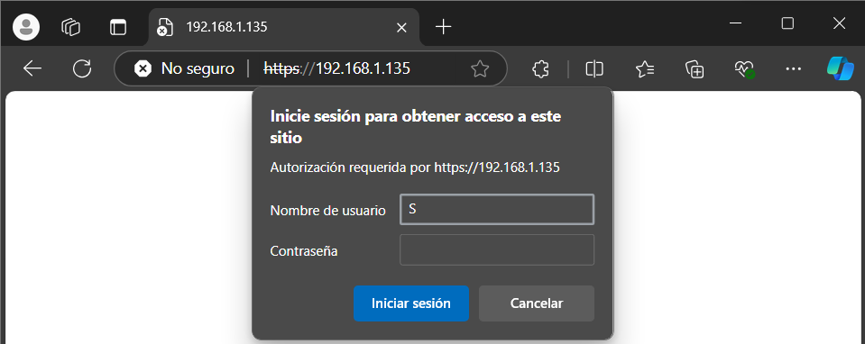
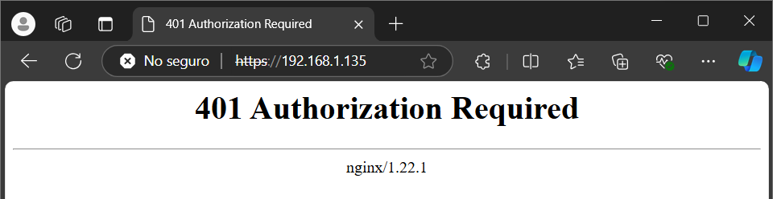
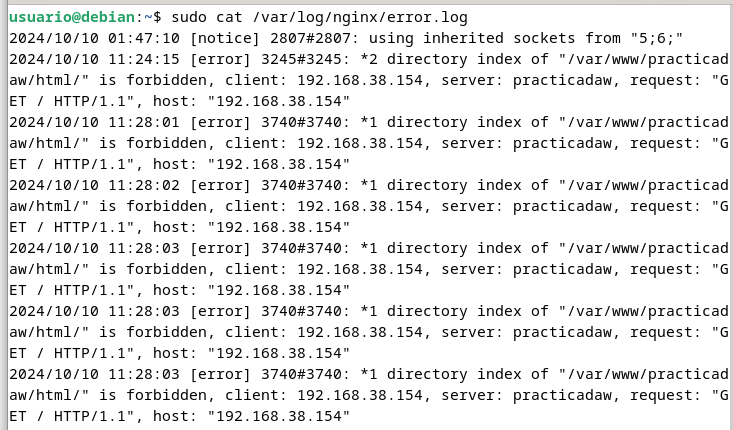
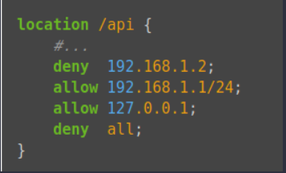
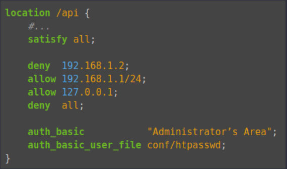
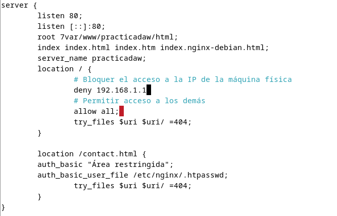
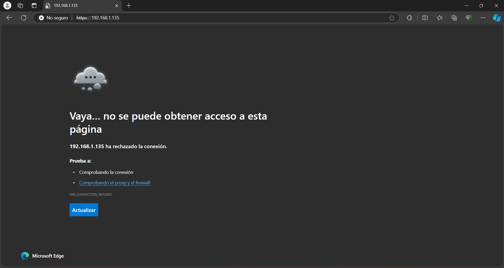

# Práctica 2.2

## Requisitos antes de comenzar la práctica

> ⚡ **Atención, muy importante antes de empezar**
> 
> - La práctica 2.1 ha de estar funcionando correctamente.
> - No empezar la práctica antes de tener la 2.1 **funcionando y comprobada**.

### Introducción

En el contexto de una transacción HTTP, la autenticación de acceso básica es un método diseñado para permitir a un navegador web, u otro programa cliente, proveer credenciales en la forma de usuario y contraseña cuando se le solicita una página al servidor.

La autenticación básica, como su nombre lo indica, es la forma más básica de autenticación disponible para las aplicaciones Web. Fue definida por primera vez en la especificación HTTP en sí y no es de ninguna manera elegante, pero cumple su función.

Este tipo de autenticación es el tipo más simple disponible pero adolece de importantes problemas de seguridad que no la hacen recomendable en muchas situaciones. No requiere el uso ni de cookies, ni de identificadores de sesión, ni de página de ingreso.

### Paquetes necesarios

Para esta práctica podemos utilizar la herramienta openssl para crear las contraseñas.

En primer lugar debemos comprobar si el paquete está instalado:

`dpkg -l | grep openssl`


Y si no lo estuviera, instalarlo.

### Creación de usuarios y contraseñas para el acceso web

Crearemos un archivo oculto llamado “.htpasswd” en el directorio de configuración /etc/nginx donde guardar nuestros usuarios y contraseñas (la -c es para crear el archivo):

`sudo sh -c "echo -n 'vuestro_nombre:' >> /etc/nginx/.htpasswd"`


Ahora crearemos un password cifrado para el usuario:

`sudo sh -c "openssl passwd -apr1 >> /etc/nginx/.htpasswd"`


Este proceso se podrá repetir para tantos usuarios como haga falta.

- Crea dos usuarios, uno con tu nombre y otro con tu primer apellido
- Comprueba que el usuario y la contraseña aparecen cifrados en el fichero:

`cat /etc/nginx/.htpasswd`


### Configurando el servidor Nginx para usar autenticación básica

Editaremos la configuración del server block sobre el cual queremos aplicar la restricción de acceso. Utilizaremos para esta autenticación el sitio web de Perfect Learn:

> ℹ️ **Info**
>-----
>Recuerda que un *server block* es cada uno de los dominios (`server {...}` dentro del archivo de configuración) de alguno de los sitios web que hay en el seridor.

`sudo nano /etc/nginx/sites-available/nombre_web`


Una vez terminada la configuración, reiniciamos el servicio para que aplique nuestra política de acceso.

`sudo systemctl restart nginx`


> 🟦 Comprobación 1
>
> Comprueba desde tu máquina física que puedes acceder al sitio web y que se te solicita autenticación.



> 🟦 Comprobación 2
>
> Comprueba que si decides cancelar la autenticación, se te negará el acceso al sitio con un error. ¿Qué error es?



### Tareas 

> 🟩 Tarea 1
> * Intenta entrar primero con un usuario erróneo y luego con otro correcto. Puedes ver todos los sucesos y registros en los logs access.log y error.log
> * Adjunta una captura de pantalla de los logs donde se vea que intentas entrar primero con un usuario inválido y con otro válido. Indica dónde podemos ver los errores de usuario inválido o no encontrado, así como donde podemos ver el número de error que os aparecía antes




Cuando hemos configurado el siguiente bloque:

```code
location / {
        auth_basic  "Àrea restringida";
        auth_basic_user_file    /etc/nginx/.htpasswd;
            try_files $uri $uri/ =404;
        }
```

La autenticación se aplica al directorio/archivo que le indicamos en la declaración del location y que en este caso el raíz /.

Así pues, esta restricción se aplica al directorio raíz o base donde residen los archivos del sitio web y que es en mi caso:

`/var/www/practicadaw/html/simple-static-website`

Y a todos los archivos que hay dentro, ya que no hemos especificado ninguno en concreto.

Ahora bien, vamos a probar a aplicar autenticación sólo a una parte de la web. Vamos a intentar que sólo se necesite autenticacíón para entrar a la parte de portfolio:

Esta sección se corresponde con el archivo `contact.html` dentro del directorio raíz.

> 🟩 Tarea 2
>
> Borra las dos líneas que hacen referencia a la autenticación básica en el location del direectorio raíz. Tras ello, añade un nuevo location debajo con la autenticación básica para el archivo/sección `contacto.html` unicamente.

> ⚠️ Warning!
>
> Fijaos que debéis tener cuidado porque la última línea del archivo ha de ser `}` que cierra la primera línea `server {` del archivo.


### Combinación de la autenticación básica con la restricción de acceso por IP

La autenticación básica HTTP puede ser combinada de forma efectiva con la restricción de acceso por dirección IP. Se pueden implementar dos escenario:

* Un usuario debe estar ambas cosas, autenticado y tener una IP válida
* Un usuario debe o bien estar autenticado, o bien tener una IP válida

Veamos cómo lo haríamos:
1. Como permitir o denegar acceso sobre una IP concreta (directivas allow y deny, respectivamente). Dentro del block server o archivo de configuración del dominio web, que recordad está en el directorio sites-available:

       

    El acceso se garantizará ala IP 192.168.1.1/24, excluyendo a la dirección 192.168.1.

    Hay que tener en cuenta que las directivas allow y deny se irán aplicando en el orden en el que aparecen el archivo.

    Aquí aplican sobre la location /api (esto es sólo un ejemplo de un hipotético directorio o archivo), pero podrían aplicar sobre cualquiera, incluida todo el sitio web, la location raíz /.

    La última directiva deny all quiere decir que por defecto denegaremos el acceso a todo el mundo. Por eso hay que poner los allow y deny más específicos justo antes de esta, porque al evaluarse en orden de aparición, si los pusiéramos debajo se denegaría el acceso a todo el mundo, puesto que deny all sería lo primero que se evaluaría.

2.  Combinar la restricción IP y la autenticación HTTP con la directiva satisfy.

    Si establecemos el valor de la directiva a “all”, el acceso se permite si el cliente satisface ambas condiciones (IP y usario válido). Si lo establecemos a “any”, el acceso se permite si se satisface al menos una de las dos condiciones.

    

### Tareas

> 🟩 Tarea 1
>
> Configura Nginx para que no deje acceder con la IP de la máquina anfitriona al directorio raíz de una de tus dos webs. Modifica su server block o archivo de configuración. Comprueba como se deniega el acceso:
> 

* Muestra la página de error en el navegador
* Muestra el mensaje de error de error.log





> 🟩 Tarea 2
>
> Configura Nginx para que desde tu máquina anfitriona se tenga que tener tanto una IP válida como un usuario válido, ambas cosas a la vez, y comprueba que sí puede acceder sin problemas.
>
