# Práctica 2.3

>[!WARNING] Atención
>
> Estos apuntes siguen aquí para temas de consulta pero a día de hoy tiene ciertas partes que pueden haberse quedado obsoletas (Heroku por ejemplo ahora es de pago), los iré actualizando en la medida que el tiempo me lo permita [en esta nueva página](https://raul-profesor.github.io/Despliegue/).
>


### Requisitos antes de comenzar la práctica

>[!WARNING] Atención, importante antes de comenzar
>
> * La práctica 2.1 ha de estar funcionando correctamente
>
> * No comenzar la práctica antes de tener la 2.1 ***funcionando y comprobada***

### Introducción

#### ¿Qué es un servidor proxy?

Un proxy de reenvío, a menudo llamado proxy, servidor proxy o proxy web, es un servidor que se encuentra frente a un grupo de máquinas cliente. Cuando esas máquinas realizan solicitudes a sitios y servicios en Internet, el servidor proxy intercepta esas solicitudes y luego se comunica con los servidores web en nombre de esos clientes, como un intermediario.

Por ejemplo, tomemos como ejemplo 3 máquinas involucradas en una comunicación típica de proxy de reenvío:

* A: Esta es la máquina del hogar de un usuario.
  
* B: este es un servidor proxy de reenvío
  
* C: este es el servidor de origen de un sitio web (donde se almacenan los datos del sitio web)

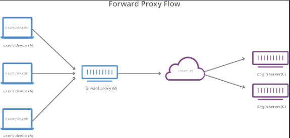

En una comunicación estándar por Internet, la máquina A se comunicaría directamente con la máquina C, con el cliente enviando solicitudes al servidor de origen y el servidor de origen respondiendo al cliente. Cuando hay un proxy de reenvío, A enviará solicitudes a B, que luego reenviará la solicitud a C. C enviará una respuesta a B, que reenviará la respuesta a A.

¿Por qué agregar este intermediario adicional a nuestra actividad en Internet?

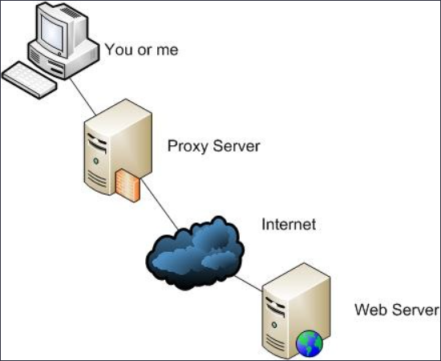

Hay algunas razones por las que uno podría querer usar un proxy de reenvío:

* **Para evitar restricciones de navegación estatales o institucionales:** algunos gobiernos, escuelas y otras organizaciones usan firewalls para dar a sus usuarios acceso a una versión limitada de Internet. Se puede usar un proxy de reenvío para sortear estas restricciones, ya que permiten que el usuario se conecte al proxy en lugar de directamente a los sitios que está visitando.

* **Para bloquear el acceso a cierto contenido:** a la inversa, los proxies también se pueden configurar para bloquear el acceso de un grupo de usuarios a ciertos sitios. Por ejemplo, una red escolar puede estar configurada para conectarse a la web a través de un proxy que habilita reglas de filtrado de contenido, negándose a reenviar respuestas de Facebook y otros sitios de redes sociales.

* **Para proteger su identidad en línea:** en algunos casos, los usuarios habituales de Internet simplemente desean un mayor anonimato en línea, pero en otros casos, los usuarios de Internet viven en lugares donde el gobierno puede imponer graves consecuencias a los disidentes políticos. Criticar al gobierno en un foro web o en las redes sociales puede dar lugar a multas o encarcelamiento para estos usuarios. Si uno de estos disidentes usa un proxy de reenvío para conectarse a un sitio web donde publica comentarios políticamente sensibles, la dirección IP utilizada para publicar los comentarios será más difícil de rastrear hasta el disidente. Solo estará visible la dirección IP del servidor proxy.

#### ¿En qué se diferencia un proxy inverso?

Estaríamos hablando del caso opuesto al anterior.

Un proxy inverso es un servidor que se encuentra frente a uno o más servidores web, interceptando las solicitudes de los clientes. Esto es diferente de un proxy de reenvío, donde el proxy se encuentra frente a los clientes. Con un proxy inverso, cuando los clientes envían solicitudes al servidor de un sitio web, esas solicitudes son interceptadas en la frontera de la red por el servidor proxy inverso. El servidor proxy inverso enviará solicitudes y recibirá respuestas del servidor del sitio web.

La diferencia entre un proxy directo y inverso es sutil pero importante. Una forma simplificada de resumir sería decir que un proxy de reenvío se encuentra frente a un cliente y garantiza que ningún servidor de origen se comunique nunca directamente con ese cliente específico. Por otro lado, un proxy inverso se encuentra frente a un servidor de origen y garantiza que ningún cliente se comunique nunca directamente con ese servidor de origen.

Una vez más, ilustremos nombrando las máquinas involucradas:

* D: cualquier número de ordenadores domésticos de los usuarios

* E: este es un servidor proxy inverso

* F: uno o más servidores de origen

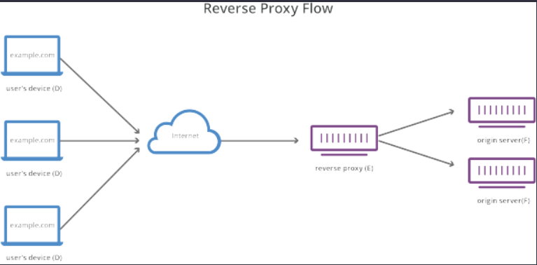

Normalmente, todas las solicitudes de D irían directamente a F, y F enviaría respuestas directamente a D. Con un proxy inverso, todas las solicitudes de D irán directamente a E, y E enviará sus solicitudes ay recibirá respuestas de F. E luego transmita las respuestas apropiadas a D.

A continuación se describen algunos de los beneficios de un proxy inverso:

* **Balanceo de carga:** es posible que un sitio web popular que recibe millones de usuarios todos los días no pueda manejar todo el tráfico entrante del sitio con un solo servidor de origen. En cambio, el sitio se puede distribuir entre un grupo de servidores diferentes, todos manejando solicitudes para el mismo sitio. En este caso, un proxy inverso puede proporcionar una solución de balanceo de carga que distribuirá el tráfico entrante de manera uniforme entre los diferentes servidores para evitar que un solo servidor se sobrecargue. En el caso de que un servidor falle por completo, otros servidores pueden intensificar para manejar el tráfico.

* **Protección contra ataques:** con un proxy inverso en su lugar, un sitio web o servicio nunca necesita revelar la dirección IP de su (s) servidor (es) de origen. Esto hace que sea mucho más difícil para los atacantes aprovechar un ataque dirigido contra ellos, como un ataque DdoS.

* **Almacenamiento en caché:** un proxy inverso también puede almacenar contenido en caché , lo que resulta en un rendimiento más rápido. Por ejemplo, si un usuario en París visita un sitio web con proxy inverso con servidores web en Los Ángeles, el usuario podría conectarse a un servidor proxy inverso local en París, que luego tendrá que comunicarse con un servidor de origen en Los Ángeles. El servidor proxy luego puede almacenar en caché (o guardar temporalmente) los datos de respuesta. Los usuarios parisinos posteriores que naveguen por el sitio obtendrán la versión en caché local del servidor proxy inverso parisino, lo que dará como resultado un rendimiento mucho más rápido.

* **Cifrado SSL** - Cifrado y descifrado SSL (o TLS comunicaciones) para cada cliente pueden ser computacionalmente caro para un servidor de origen. Se puede configurar un proxy inverso para descifrar todas las solicitudes entrantes y cifrar todas las respuestas salientes, liberando valiosos recursos en el servidor de origen.

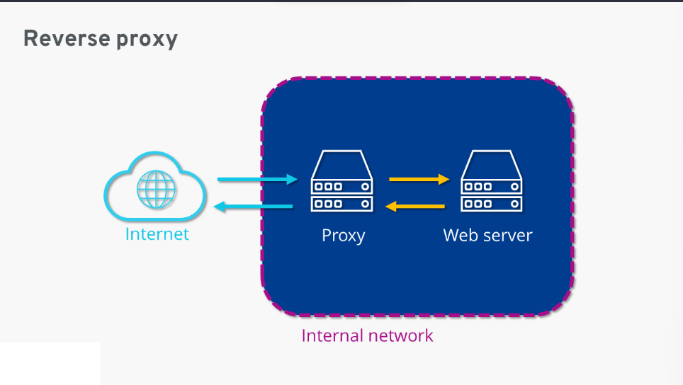

### Tarea

#### Configuraciones

##### Nginx servidor web

Vamos a configurar dos Debian con sendos servidores Nginx. Tenéis la máquina virtual inicial y debéis clonarla para tener una segunda:

* Uno servirá las páginas web que ya hemos configurado, así pues utilizaremos el servidor que ya tenemos configurado de la Práctica 2.1.

* El nuevo servidor clon Debian con Nginx configurado como proxy inverso

* Realizaremos las peticiones HTTP desde el navegador web de nuestra máquina física/anfitrión hacia el proxy clonado, que nos redirigirá al servidor web original

>[!WARNING]Cuidado
>
>Ojo al clonar las máquinas virtuales porque hay que darle a crear una nueva MAC, de lo contrario no tendréis IP en esa máquina.

El diagrama de red quedaría así:

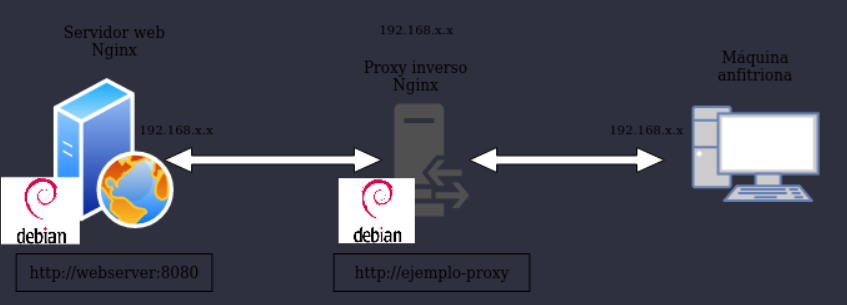


Para que todo quede más diferenciado y os quede más claro que la petición está pasando por el proxy inverso y llega al servidor web destino, vamos a hacer que cada uno de los servidores escuche las peticiones en un puerto distinto.

1. En primer lugar, debéis cambiar el nombre que tuviera vuestra web por el de `webserver`, ello implica:

* Cambiar el nombre del archivo de configuración de sitios disponibles para Nginx

* Cambiar el nombre del sitio web dentro de este archivo de configuración donde haga falta

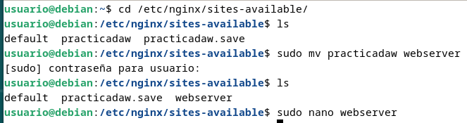

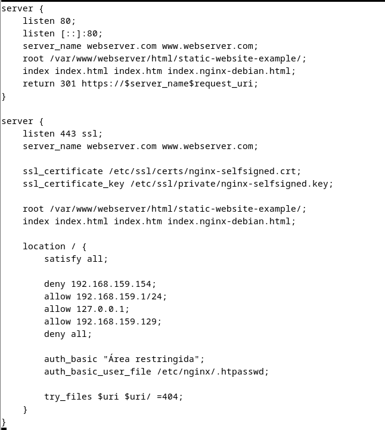

* No os olvidéis de eliminar el link simbólico antiguo con el comando `unlink nombre_del_link` dentro de la carpeta `sites-enabled` y crear el nuevo para el nuevo nombre de archivo.

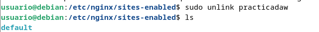


1. En el archivo de configuración del sitio web, en lugar de hacer que el servidor escuche en el puerto 80, cambiadlo al 8080.

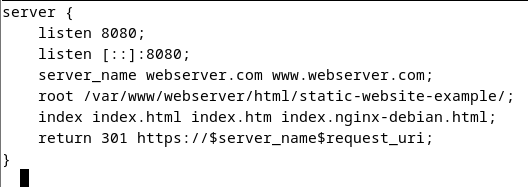

2. Reiniciar Nginx

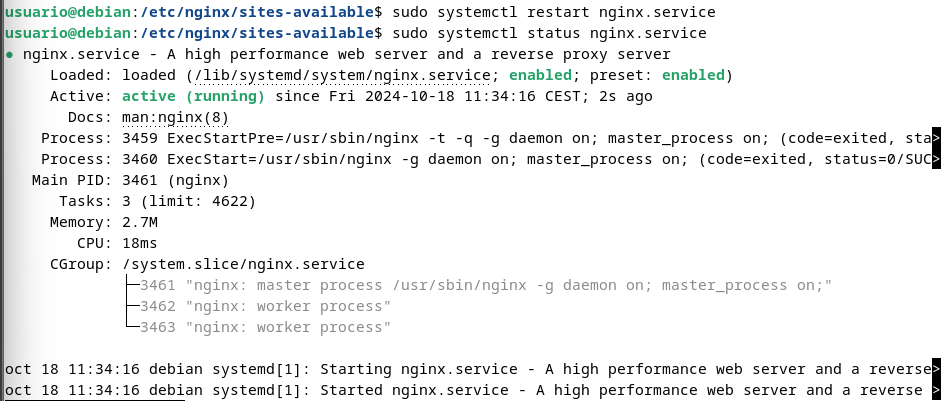

##### Nginx proxy inverso

Ahora, cuando intentamos acceder a `http://ejemplo-proxy` (o el nombre que tuvieráis de vuestra web de las prácticas anteriores), en realidad estaremos accediendo al proxy, que nos redirigirá a `http://webserver:8080`, el servidor web que acabamos de configurar para que escuche con ese nombre en el puerto 8080.

Para ello:

* Crear un archivo de configuración en sites-available con el nombre `ejemplo-proxy` (o el que tuvieráis vosotros)

* Este archivo de configuración será más simple, tendrá la siguiente forma

```code
server { 
    listen __; 
    server_name ____________; 
    location / { 
    proxy_pass http://_________:____; 
    } 
} 
```
Donde, ***mirando el diagrama de red y teniendo en cuenta la configuración hecha hasta ahora***, debéis completar:

* El puerto donde está escuchando el proxy inverso

* El nombre de vuestro dominio o sitio web original al que accedemos en el proxy

* La directiva `proxy_pass` indica a dónde se van a redirigir las peticiones, esto es, al servidor web. Por tanto, debéis poner la IP y número de puerto adecuados de vuestro sitio web configurado en el apartado anterior.

* Crear el link simbólico pertinente

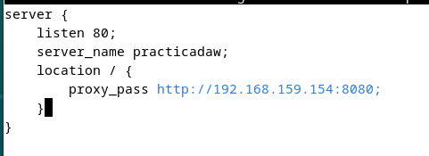

Esto es para simular la situación en la que nosotros, como clientes, cuando accedamos a nuestro sitio web, no necesitemos saber cómo está todo configurado, sólo necesitamos saber el nombre de la web.

>[!WARNING]¡Atención, muy importante!
>
> **Debéis modificar el archivo host que configurastéis en la práctica 2.1. Si miráis el diagrama de red, ahora el nombre de vuestro sitio web se corresponderá con la IP de la nueva máquina clon que hace de proxy.** Será ésta la encargada de redirigirnos automáticamente al verdadero sitio web.


### Comprobaciones

Si accedéis a vuestro sitio web, debéis poder seguir accediendo sin problemas.

* Comprobad en los access.log de los dos servidores que llega la petición


* Comprobad además la petición y respuesta con las herramientas de desarrollador de Firefox en Xubuntu. Pulsando F12 en el navegador os aparecerán estas herramientas

Comprobación de ejemplo:

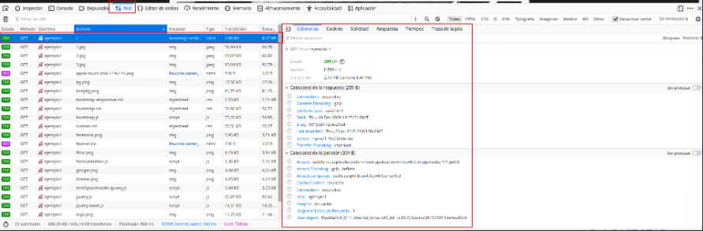

En la primera petición (marcada en rojo), utilizando el apartado “Red” (también marcado en rojo) y también en rojo está señalado dónde se puede ver la respuesta de la petición GET HTTP (200 OK).

También vemos las cabeceras que se incluyen en la petición (método GET) y en la respuesta a esta petición.

#### Añadiendo cabeceras

Además de haber mirado los logs, vamos a demostrar aún de forma más clara que la petición está pasando por el proxy inverso y que está llegando al servidor web y que vuelve por el mismo camino.

Si recordáis de teoría, el servidor web es capaz de añadir cabeceras en las respuestas a las peticiones.

Así pues, vamos a configurar tanto el proxy inverso como el servidor web para que añadan cada uno la cabecera “Host” que también vimos en teoría.

Para añadir cabeceras, en el archivo de configuración del sitio web debemos añadir dentro del bloque `location / { … }` debemos añadir la directiva:

```code
add_header Host nombre_del_host;
```

1. Añadiremos primero esta cabecera únicamente en el archivo de configuración del sitio web del proxy inverso. El Nombre_del_host será Proxy_inverso_vuestronombre.

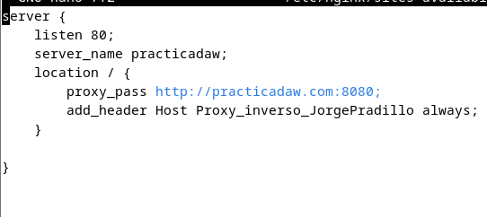

1. Reiniciamos Nginx


1. Comprobamos que podemos acceder al sitio web sin problemas

2. Con las herramientas de desarrollador comprobamos que la petición ha pasado por el proxy inverso que ha añadido la cabecera en la respuesta:

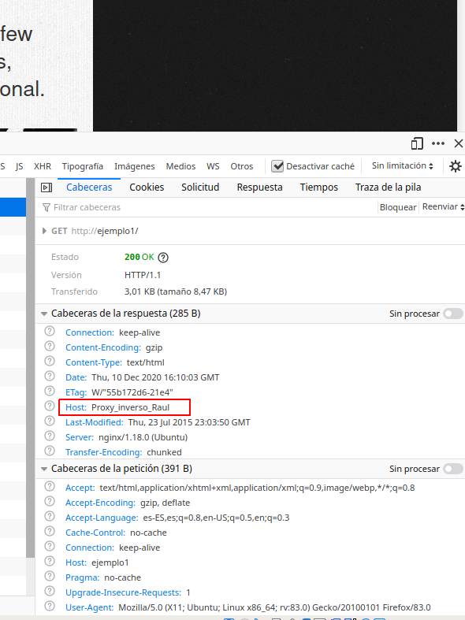

En nuestro caso, aun habiendo hecho estos ajustes, sigue sin salir el host con el nombre que le hemos indicado.

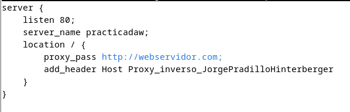

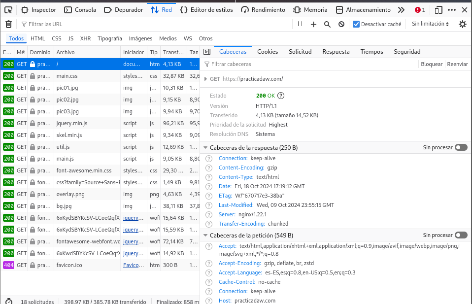

Para cambiar esto lo que hemos hecho ha sido añadir dos cambio de nombre en el servidor proxy.

Hacemos lo propio con el servidor web. Esta vez el `Nombre_del_host` será `servidor_web_vuestronombre`.

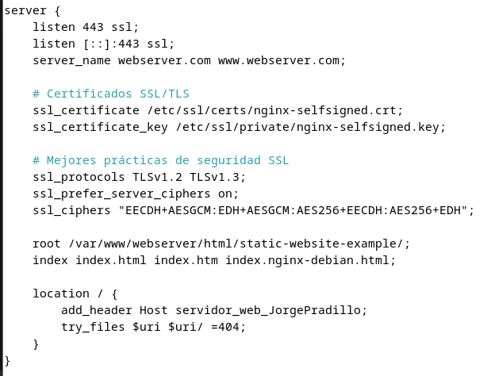

Si todo está configurado correctamente, al examinar las peticiones y respuestas, os aparecerán las dos cabeceras que han incluido en la respuesta tanto el proxy inverso como el servidor web. .

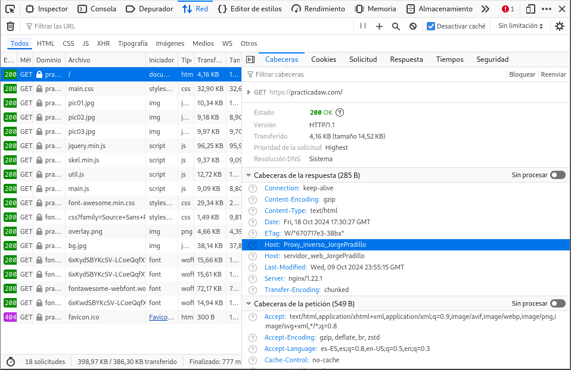

Es muy importante que para realizar estas comprobaciones tengáis marcado el checkbox Desactivar caché o en una ventana privada del navegador.


Si no marcáis esto, la página se guardará en la memoria caché del navegador y no estaréis recibiendo la respuesta del servidor sino de la caché del navegador, lo que puede dar lugar a resultados erróneos.