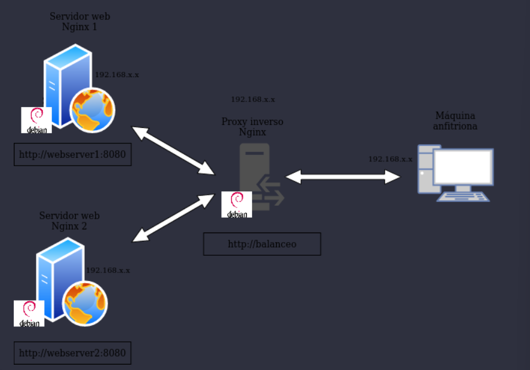
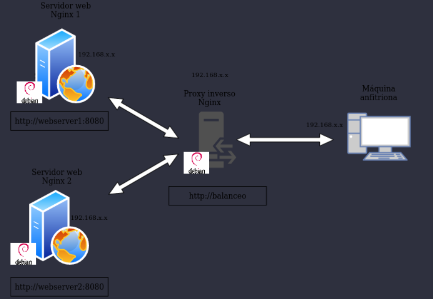
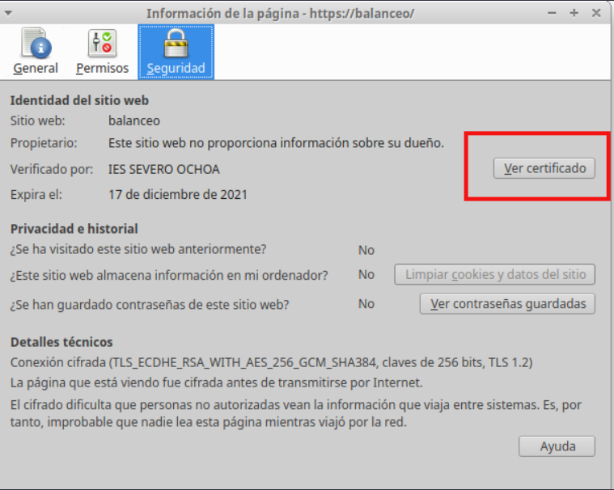

# Práctica 2.4 - Balanceo de carga con proxy inverso en Nginx

> [!WARNING]Atención
>
>Estos apuntes siguen aquí para temas de consulta pero a día de hoy tiene ciertas partes que pueden haberse quedado obsoletas (Heroku por ejemplo ahora es de pago), los iré actualizando en la medida que el tiempo me lo permita en esta nueva página.

### Requisitos aantes de comenzar la práctica

> [!WARNING]Atención, muy importante antes de empezar
>
> - La práctica 2.3 debe estar funcionando correctamente
> - No empezar la práctica antes de tener la 2.3 funcionando y comprobada

### Introducción
Los servidores proxy inversos y los balanceadores de carga son componentes de una arquitectura informática cliente-servidor. Ambos actúan como intermediarios en la comunicación entre los clientes y los servidores, realizando funciones que mejoran la eficiencia.

Las definiciones básicas son simples:

- Un [proxy inverso](https://www-nginx-com.translate.goog/resources/glossary/reverse-proxy-server?_x_tr_sl=en&_x_tr_tl=es&_x_tr_hl=es) acepta una solicitud de un cliente, la reenvía a un servidor que puede cumplirla y devuelve la respuesta del servidor al cliente.

- Un [balanceador de carga](https://www-nginx-com.translate.goog/resources/glossary/load-balancing?_x_tr_sl=en&_x_tr_tl=es&_x_tr_hl=es) distribuye las solicitudes entrantes del cliente entre un grupo de servidores, en cada caso devolviendo la respuesta del servidor seleccionado al cliente apropiado.

Suenan bastante similares, ¿verdad? Ambos tipos de aplicaciones se ubican entre clientes y servidores, aceptando solicitudes del primero y entregando respuestas del segundo. No es de extrañar que haya confusión sobre qué es un proxy inverso y un balanceador de carga. Para ayudar a diferenciarlos, exploremos cuándo y por qué normalmente se implementan en un sitio web. .

#### Proxy inverso

Ya conocemos este concepto de la práctica anterior.

Mientras que implementar un balanceador de carga solo tiene sentido cuando se tienen varios servidores, a menudo tiene sentido implementar un proxy inverso incluso con un solo servidor web o servidor de aplicaciones.

Se puede pensar en el proxy inverso como la "cara pública" de un sitio web. Su dirección es la que se anuncia para el sitio web y se encuentra en la frontera de la red del sitio para aceptar solicitudes de navegadores web y aplicaciones móviles para el contenido alojado en el sitio web.

#### Balanceadores de carga

Los balanceadores de carga se implementan con mayor frecuencia cuando un sitio necesita varios servidores porque el volumen de solicitudes es demasiado para que un solo servidor lo maneje de manera eficiente.

La implementación de varios servidores también elimina un solo punto de fallo, lo que hace que el sitio web sea más confiable. Por lo general, todos los servidores alojan el mismo contenido, y el trabajo del balanceador de carga es distribuir la carga de trabajo de manera que se haga el mejor uso de la capacidad de cada servidor, evite la sobrecarga en cualquiera de ellos y dé como resultado la respuesta más rápida posible al cliente. .

**Un balanceador de carga también puede mejorar la experiencia del usuario al reducir la cantidad de respuestas de error que ve el cliente. Lo hace detectando cuándo los servidores caen y desviando las solicitudes de ellos a los otros servidores del grupo.** En la implementación más simple, el balanceador de carga detecta el estado del servidor al interceptar las respuestas de error a las solicitudes regulares.

En esta práctica tendremos el escenario donde Nginx hará tanto de proxy inverso como de balanceador de carga al mismo tiempo.

>[!NOTE] Info
>
>En esta práctica tendremos un escenario donde Nginx hará tanto de proxy inverso como de balanceador de carga al mismo tiempo

### Tarea

Vamos a configurar dos servidores web Nginx con dos máquinas Debian, además de reutilizar el proxy inverso Nginx configurado en la práctica anterior. Partiremos por tanto de la configuración de la práctica anterior, añadiendo lo necesario:

* Cada servidor web presentará un sitio web específico para esta práctica
    * El webserver2 debe tener la IP asignada de forma fija mediante la configuración DHCP.
* El proxy inverso que ya teníamos configurado, habrá ahora que configurarlo para que realice el balanceo de carga que deseamos
* Realizaremos las peticiones HTTP desde el navegador web de nuestra máquina anfitriona.

El diagrama de red quedaría así:



Haremos las peticiones web desde el navegador al proxy inverso, que las repartirá entre los dos servidores web que tenemos.

Accederemos a `http://balanceo` y debemos observar que las peticiones, efectivamente, se van repartiendo entre el servidor 1 y el 2.

### Configuraciones

> [!WARNING] Atención
>
> Ya no vamos a utilizar los sitios web que hemos configurado en las prácticas anteriores. Por ello, para evitarnos una serie de problemas que pueden surgir, vamos a desactivarlos.
>
> Dentro de la carpeta `/etc/nginx/sites-enabled` debemos ejecutar `unlink nombre_archivo` para cada uno de los archivos de los sitios web que tenemos.
>
> **Si no hacéis esto obtendréis errores en todas las prácticas que quedan de este tema.**

#### Nginx Servidor Web 1

El primer servidor web será el servidor principal que hemos venido utilizando hasta ahora durante el curso, el original, donde tenemos instalado ya el servicio Web.

Debemos configurar este servidor web para que sirva el siguiente `index.html` que debéis crear dentro de la carpeta `/var/www/webserver1/html`:

```html
<html lang="es">
<head>
    <title>Prueba de balanceo de carga con Nginx</title>
</head>
<body>
    <h2>Este es el servidor web 1</h2>
    <p>Comprueba el balanceo de carga con Nginx recargando esta página</p>>
</body>
</html>
```

- El nombre del sitio web que debéis utilizar en los archivos correspondientes (sites-available…) que debéis crear para Nginx es `webserver1`, así como en sus configuraciones. Fijáos en las configuraciones que hicisteis en prácticas anteriores a modo de referencia.
- El sitio web debe escuchar en el puerto 8080.
- Debéis añadir una cabecera que se llame `Serv_Web1_vuestronombre`.

#### Nginx Servidor Web 2

Debe ser una máquina Debian, clon del servidor web 1.

En este servidor web debemos realizar una configuración idéntica al servidor web 1 pero cambiando `webserver1` por `webserver2` (también en el index.html), así como el nombre de la cabecera añadida, que será `Serv_Web2_vuestronombre`.

> [!WARNING]Warning
>
> Es importante que no quede ninguna referencia a webserver1 por ningún archivo, de otra forma os dará resultados erróneos y os dificultará mucho encontrar el error.

#### Nginx Proxy Inverso

Ya disponemos de los dos servidores web entre los que se van a repartir las peticiones que realice el cliente desde el navegador.

Vamos, por tanto, a configurar el proxy inverso para que realice este reparto de peticiones:

En sites-available debéis crear el archivo de configuración con el nombre *balanceo*.

Este archivo tendrá el siguiente formato:

```
    upstream backend_hosts {
                random;
                server ________:____;
                server ________:____;
    }
            server {
                listen 80;
                server_name ________;      
                location / {
                    proxy_pass http://backend_hosts;
                }
            }
```

Donde:

- El bloque upstream → son los servidores entre los que se va a repartir la carga, que son los dos que hemos configurado anteriormente.

- Si miráis el diagrama y tenéis en cuenta la configuración que habéis hecho hasta ahora, aquí deberéis colocar la IP de cada servidor, así como el puerto donde está escuchando las peticiones web.

- A este grupo de servidores le ponemos un nombre, que es `backend_hosts`

> [!NOTE]Aclaración
>
> En un sitio web, el backend se encarga de todos los procesos necesarios para que la web funcione de forma correcta. Estos procesos o funciones no son visibles pero tienen mucha importancia en el buen funcionamiento de un sitio web.

- El parámetro random lo que hace es repartir las peticiones HTTP que llegan al proxy inverso de forma completamente aleatoria entre el grupo de servidores que se haya definido en el bloque upstream (en nuestro caso sólo hay dos).

    - Pondremos random porque es lo más fácil para comprobar que todo funciona bien en la práctica, pero hay diferentes formas de repartir la carga (las peticiones HTTP).

### Comprobaciones

Si accedéis a vuestro sitio web, debéis poder seguir accediendo sin problemas.

- Comprobad dándole repetidamente a F5, que accedéis cada vez a uno de los servidores. Se os mostrará el contenido del index.html del servidor correspondiente cada vez.

    - Para una doble comprobación, utilizando las herramientas de desarrollador, mostrad que la web que se os muestra coincide con la cabecera que ha añadido el servidor web en la respuesta HTTP.

> [!NOTE]Recordatorio
>
> Recordad que es muy importante que para realizar estas comprobaciones tengáis marcado el checkbox Desactivar caché.
>
> 
>
> Si no marcáis esto, la página se guardará en la memoria caché del navegador y no estaréis recibiendo la respuesta del servidor sino de la caché del navegador, lo que puede dar lugar a resultados erróneos.
>
> Otra opción, si esto no funcionara, es hacer las pruebas con una nueva ventana privada del navegador.

#### Comprobación del balanceo de carga cuando cae un servidor

Nuestro balanceador de carga está constantemente monitorizando “la salud” de los servidores web. De esta forma, si uno deja de funcionar por cualquier razón, siempre enviará las solicitudes a los que queden “vivos”. Vamos a comprobarlo:

* Para el servicio Nginx en el servidor web 1 y comprueba, de la misma forma que en el apartado anterior, que todas las solicitudes se envían ahora al servidor web 2

* Tras iniciar de nuevo Nginx en el servidor web 1, repite el proceso con el servidor web 2.

### Cuestiones finales

---
> [!TIP]Cuestión 1
>
> Busca información de qué otros métodos de balanceo se pueden aplicar con Nginx y describe al menos 3 de ellos.
---

Otros métodos de balanceo que se pueden aplicar con Nginx son por ejemplo:

1. Round-robin → Lo que hace es distribuir las solicitudes de forma secuencial entre los servidores.
2. Least Connections → Envía las solicitudes al servidor que contiene menos conexiones activas.
3. IP Hash → La distribución se basa en la dirección IP del cliente. Le asigna al mismo cliente el mismo servidor siempre.

---
> [!TIP]Cuestión 2
>
> Si quiero añadir 2 servidores web más al balanceo de carga, describe detalladamente qué configuración habría que añadir y dónde.
---

Solamente hay que añadir las ip al bloque upstream de balanceo. Por ejemplo:
```
upstream backend_hosts {
    random;
    server 192.168.159.154:8080;
    server 192.168.159.144:8080;
    server 192.168.159.168:8080;
    server 192.168.159.129:8080;
}
```

---
> [!TIP]Cuestión 3
>
> Describe todos los pasos que deberíamos seguir y configurar para realizar el balanceo de carga con una de las webs de prácticas anteriores.
>
> Indicad la configuración de todas las máquinas (webservers, proxy...) y de sus servicios
---

Para realizar el balanceo de carga utilizando Nginx con los servidores web de las prácticas anteriores, necesitas seguir una serie de pasos que abarcan la configuración de los servidores web, el proxy inverso y las pruebas de funcionamiento. A continuación, se describe un procedimiento detallado que incluye la configuración de todas las máquinas involucradas.

# PASO 1: CONFIGURACIÓN DE LOS SERVIDORES WEB

## WEBSERVER1

### Desactivamos los sitios web de las practicas anteriores

Para ello utilizamos el comando sudo unlink `/etc/nginx/sites-enabled/webserver`


### Creamos el archivo de configuracion para webserver1 en la carpeta /etc/nginx/sites-available y enlazamos a sites-enabled

```
server {
    listen 8080;
    server_name webserver1;

    root /var/www/webserver1/html;
    index index.html;

    add_header Serv_Web1 "tu_nombre";

    location / {
        try_files $uri $uri/ =404;
    }
}
```

Después de poner esto en el archivo `/etc/nginx/sites-available/webserver1` enlazamos a `sites-enables` con el comando sudo ln -s /etc/nginx/sites-available/webserver1 /etc/nginx/sites-enabled/


### Archivo index.html en /var/www/webserver1/html

Creamos el directorio `/var/www/webserver1/html` y creamos en él, el archivo `index.html` con el siguiente código:

```html
<html lang="es">
<head>
    <title>Prueba de balanceo de carga con Nginx</title>
</head>
<body>
    <h2>Este es el servidor web 1</h2>
    <p>Comprueba el balanceo de carga con Nginx recargando esta página</p>>
</body>
</html>
```


### Reiniciar NGINX con el comando: `sudo systemctl restart nginx.config`


### Clonamos ahora la máquina virtual y le ponemos el nombre webserver2

IMPORTANTE
---
Hay que cambiar la opción de la dirección MAC


## WEBSERVER2 

### Repetimos los procesos pero cambiando webserver1 por webserver2

### Cambios en /etc/nginx/sites-available/webserver2



### Cambios html


### Reiniciar NGINX


### Vamos a la máquina que configuramos el proxy inverso en la práctica 2.3

## Balanceo de Carga

### Archivo de configuración


### Enlace de balanceo a sites-enabled


### Reiniciar NGINX


### Configuración /etc/hosts de todas las máquinas

#### Webserver1



#### Webserver2


#### Proxy inverso 


### Reiniciar NGINX


### Mensajes que se muestran al entrar a http://balanceo y pulsar F5 desde la máquina anfitriona.


